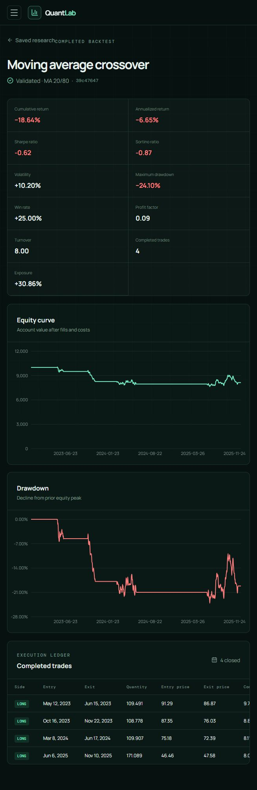
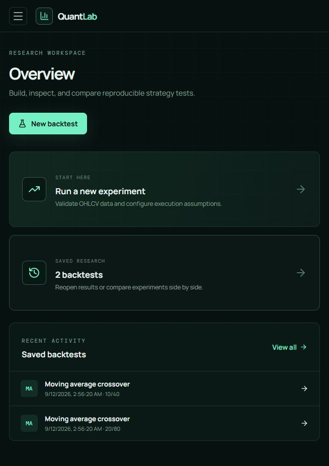
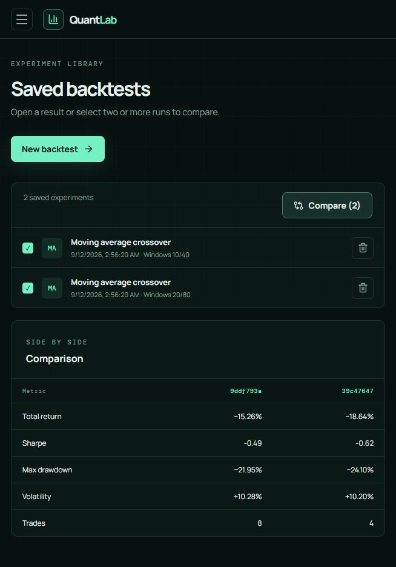
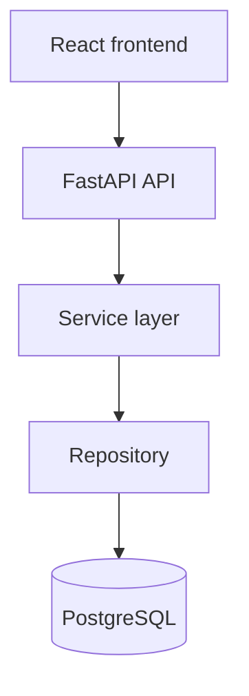
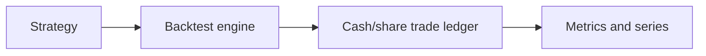

# QuantLab

**Python quantitative research + backtesting SaaS.**

[GitHub repository](https://github.com/sankarshana2105-csdsaiml/quantlab-saas) · Public deployment pending Render authorization

QuantLab is a Python-first quantitative research SaaS for validating OHLCV data, running causally aligned backtests, and preserving user-owned experiments. It is built as a portfolio project around one principle: attractive results are meaningless unless the ledger, timing, costs, and out-of-sample boundaries are correct.



## What it demonstrates

- Next-open execution with explicit cash, shares, fills, slippage, and commissions
- Completed-trade metrics, equity, drawdown, exposure, turnover, and long/short accounting
- Causal rolling signals and leakage-safe chronological/walk-forward evaluation
- FastAPI contracts with clean validation and non-leaking errors
- Argon2 passwords, short-lived algorithm-pinned JWTs, and repository-level user isolation
- SQLAlchemy 2.x persistence with Alembic migrations on SQLite and PostgreSQL
- Responsive React/TypeScript research, results, saved-run, and comparison workflows

## Product views

| Research workspace | Experiment comparison |
|---|---|
|  |  |

Additional genuine local captures: [research builder](docs/screenshots/research-builder.jpg) and [saved experiments](docs/screenshots/saved-backtests.jpg). The deterministic quantitative plot remains in [results/sample_backtest.png](results/sample_backtest.png).

## Architecture





The HTTP layer orchestrates only. Quantitative calculations remain in `quantlab/backtest.py`, data rules in `quantlab/data.py`, and leakage-safe evaluation in `quantlab/evaluation.py`.

## Quantitative assumptions

- A signal formed with data through close *t* can first execute at open *t+1*.
- The prior holding owns the overnight close-to-open move; the new holding owns only post-fill movement.
- Positions use fixed shares until a target-side change. Every order changes cash.
- Commission is charged on filled notional; slippage moves the fill price adversely.
- Reversals close the old side before opening the new side and pay both legs.
- Win rate, profit factor, and trade count use completed net trades, not return bars.
- Walk-forward folds tune on history only, start the OOS account in cash, and carry actual—not hypothetical—OOS state.

The deterministic sample ledger reconciles equity, metrics, and completed trades within `1e-12`. See [SAMPLE_BACKTEST.md](SAMPLE_BACKTEST.md) and [PHASE1_AUDIT.md](PHASE1_AUDIT.md).

## Stack

Python 3.12, pandas, NumPy, FastAPI, Pydantic, SQLAlchemy 2.x, Alembic, PostgreSQL/SQLite, Argon2, JWT, React 19, TypeScript, Vite, Recharts, Vitest, and pytest.

## Local setup

```bash
python -m venv .venv
# Activate the environment, then:
pip install -e ".[dev,demo]"
cp .env.example .env
alembic upgrade head
uvicorn quantlab.api.app:app --reload
```

Set a random `JWT_SECRET` of at least 32 characters in `.env`. In another terminal:

```bash
cd frontend
corepack enable
pnpm install --frozen-lockfile
pnpm dev
```

Open `http://localhost:5173`. The Vite proxy reaches the local API without a frontend environment override.

## Configuration

| Variable | Purpose |
|---|---|
| `DATABASE_URL` | SQLAlchemy database URL; PostgreSQL is mandatory in production mode |
| `JWT_SECRET` | Private signing secret, minimum 32 characters |
| `JWT_EXPIRE_MINUTES` | Positive access-token lifetime; default `30` |
| `CORS_ORIGINS` | Comma-separated exact frontend origins; wildcards are rejected |
| `ALLOWED_HOSTS` | Optional comma-separated HTTP Host allowlist |
| `ENVIRONMENT` | `development`, `test`, or `production` |
| `MAX_DATASET_BARS` | Server-side dataset row cap; default `100000` |
| `VITE_API_URL` | Browser-visible production API origin |

## Verification

```bash
pytest
cd frontend && pnpm test && pnpm typecheck && pnpm build
alembic upgrade head && alembic check
```

The opt-in PostgreSQL integration test recreates a dedicated database named exactly `quantlab_test`, migrates from scratch, exercises registration, rollback, save/restart/read/delete, and reconciles stored output with the direct engine:

```bash
QUANTLAB_POSTGRES_TEST_URL="postgresql+psycopg://.../quantlab_test" pytest tests/test_postgres_integration.py
```

## Deployment

`render.yaml` defines a PostgreSQL database, production FastAPI service, and SPA static site. Commit and push the repository to GitHub/GitLab, connect it as a Render Blueprint, then set:

- API `CORS_ORIGINS` to the exact deployed frontend URL and `ALLOWED_HOSTS` to the API hostname.
- Frontend `VITE_API_URL` to the deployed API URL, then redeploy the static site.

The backend runs Alembic before Uvicorn, fails clearly on unsafe production configuration, and exposes a database-backed `/health`. Render rewrites frontend routes to `index.html`. See [Render's FastAPI guide](https://render.com/docs/deploy-fastapi) and [Blueprint reference](https://render.com/docs/blueprint-spec).

Exact launch and verification steps are in [DEPLOYMENT.md](DEPLOYMENT.md). Interview preparation is in [QUANTLAB_INTERVIEW.md](QUANTLAB_INTERVIEW.md).

## Honest limitations

- Research runs are synchronous and intended for moderate daily-bar datasets, not distributed workloads.
- Result series are not paginated; the enforced 100,000-bar upload cap bounds the worst case.
- JWTs are stateless and cannot be revoked before expiry; logout removes the browser token.
- Session storage reduces persistence but does not eliminate XSS risk; no refresh tokens, MFA, or password reset exist.
- One moving-average strategy is exposed; this is a correctness-focused engine, not a strategy marketplace.
- This is research software, not investment advice or a live-trading system.

## Roadmap

Background job execution, paginated/downsampled result series, refresh-token rotation, additional validated strategies, and CI-hosted PostgreSQL integration tests.
